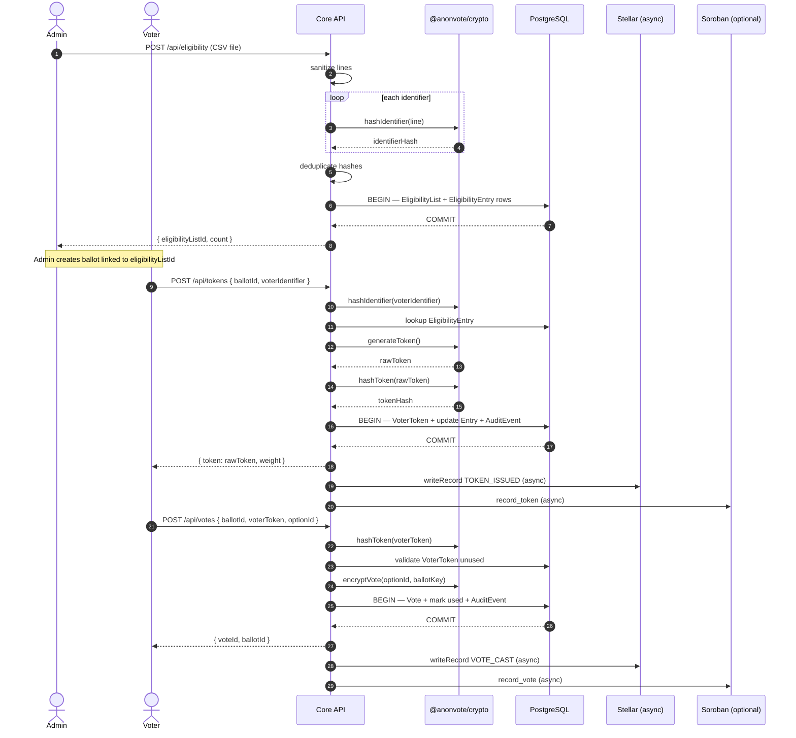
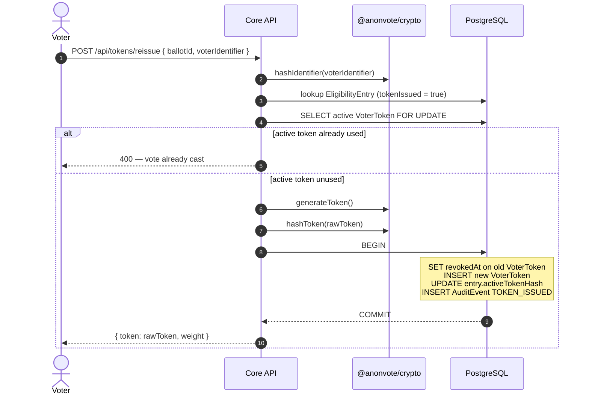
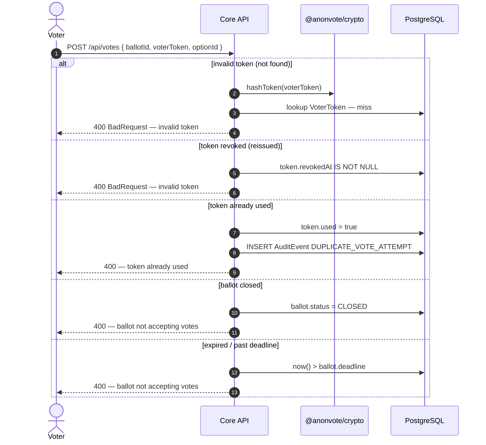

# Token Flow Specification

**Status:** Active  
**Scope:** End-to-end flow from eligibility list ingestion through token invalidation after vote submission  
**Audience:** Contributors implementing token issuance, redemption, reissue, and audit in `AnonVote/core`, `@anonvote/crypto`, and `AnonVote/contracts`

This document is the authoritative specification for the AnonVote token lifecycle. Implementations must conform to the sequences, persistence boundaries, and transaction scopes defined here. Cryptographic primitive details live in [`specs/crypto.md`](crypto.md); composition rules live in [`specs/crypto-integration-guide.md`](crypto-integration-guide.md).

---

## Privacy invariants

These invariants apply to every phase:

| Invariant | Requirement |
| --- | --- |
| No raw identifiers in storage | After `hashIdentifier`, only `identifierHash` is persisted |
| No raw tokens in storage | After `hashToken`, only `tokenHash` is persisted |
| No identifier–vote join | `Vote` rows must not store voter identifiers or raw tokens |
| Hash-only comparison | Token validation compares `hashToken(submitted)` to stored `tokenHash`, never plaintext |
| Audit events are metadata-only | Audit rows store `ballotId` and `eventType` only — never raw identifiers, raw tokens, or token hashes |

The reissue flow (Phase 4) introduces a controlled, issuance-scoped association between an eligibility entry and an active token hash. That association is specified explicitly so reissue remains correct in multi-voter ballots without exposing other voters' token hashes.

---

## Reference map

| Layer | Artifact | Role in token flow |
| --- | --- | --- |
| `@anonvote/crypto` | `hashIdentifier`, `generateToken`, `hashToken`, `encryptVote` | [`AnonVote/js` — `src/crypto.ts`](https://github.com/AnonVote/js/blob/main/src/crypto.ts) |
| Core API | `POST /api/eligibility` | Eligibility upload — [`routes/eligibility.ts`](https://github.com/AnonVote/core/blob/main/backend/src/routes/eligibility.ts) |
| Core API | `POST /api/tokens` | Token issuance — [`routes/tokens.ts`](https://github.com/AnonVote/core/blob/main/backend/src/routes/tokens.ts) |
| Core API | `POST /api/tokens/reissue` | Lost-token reissue — same route file |
| Core API | `POST /api/votes` | Vote redemption — [`routes/votes.ts`](https://github.com/AnonVote/core/blob/main/backend/src/routes/votes.ts) |
| Core service | `identityManager.issueToken()` | Token issuance logic |
| Core service | `identityManager.reissueToken()` | Reissue logic |
| Core service | `privacyEngine.submitVote()` | Redemption logic |
| Core service | `stellarService.writeRecord()` | Off-chain audit anchoring (fire-and-forget) |
| Soroban | `AnonVoteContract.record_token()` | On-chain token-issued counter — [`specs/smart-contracts.md`](smart-contracts.md) |
| Soroban | `AnonVoteContract.record_vote()` | On-chain vote-cast counter |
| Database | `EligibilityEntry`, `VoterToken`, `Vote`, `AuditEvent` | [`schema.prisma`](https://github.com/AnonVote/core/blob/main/backend/prisma/schema.prisma) |

---

## Data model (token-related)

### `EligibilityEntry`

| Field | Type | Set in | Notes |
| --- | --- | --- | --- |
| `identifierHash` | `string` | Phase 1 | SHA-256 hex from `hashIdentifier` |
| `weight` | `int` | Phase 1 | Default `1`; returned at issuance |
| `tokenIssued` | `bool` | Phase 2 | Set `true` atomically with first token creation |
| `activeTokenHash` | `string?` | Phase 2, 4 | **Normative.** Hash of the currently valid token for this entry |
| `issuanceGeneration` | `int` | Phase 2, 4 | **Normative.** Monotonic counter; incremented on each issue/reissue |

Unique constraint: `(eligibilityListId, identifierHash)`.

### `VoterToken`

| Field | Type | Set in | Notes |
| --- | --- | --- | --- |
| `tokenHash` | `string` | Phase 2 | Unique; SHA-256 hex from `hashToken` |
| `ballotId` | `string` | Phase 2 | Must match requesting ballot |
| `used` | `bool` | Phase 3, 5 | Set `true` on successful vote |
| `usedAt` | `datetime?` | Phase 3 | Set with `used = true` |
| `revokedAt` | `datetime?` | Phase 4, 5 | **Normative.** Soft-invalidation timestamp |
| `issuanceGeneration` | `int` | Phase 2, 4 | **Normative.** Must match parent entry at creation time |

No foreign key from `VoterToken` to `EligibilityEntry`. The `activeTokenHash` + `issuanceGeneration` pair on the entry is the only issuance-scoped link, and stores a hash — never a raw token.

---

## Phase 1 — Eligibility ingestion

**Actor:** Organization admin (authenticated)  
**Endpoint:** `POST /api/eligibility`  
**Auth:** Session required

### Input

- Multipart upload: field name `file`
- Accepted types: CSV or plain text (`text/csv`, `text/plain`)
- Max file size: 10 MB
- Max lines: 100,000
- Max line length: 256 characters after sanitization

Each non-empty line is one voter identifier (email, employee ID, etc.). Extended CSV formats with a weight column are out of scope for v1; `weight` defaults to `1`.

### Processing steps

1. **Parse.** Read file as UTF-8. Strip BOM if present. Split on `\r?\n`.
2. **Sanitize each line.** Trim whitespace, collapse internal runs of whitespace to a single space, strip control characters (`\x00`–`\x08`, `\x0B`, `\x0C`, `\x0E`–`\x1F`, `\x7F`). Skip empty lines.
3. **Hash.** For each sanitized line, compute `identifierHash = hashIdentifier(line)` via `@anonvote/crypto`.
4. **Deduplicate.** Maintain an in-memory `Set` of seen hashes. If `hashIdentifier(a)` equals `hashIdentifier(b)` after normalization (e.g. `User@Org.com` and `user@org.com`), keep one entry; discard duplicates silently.
5. **Persist** inside a single database transaction:
   - Create `EligibilityList` row
   - Bulk-insert `EligibilityEntry` rows: `{ eligibilityListId, identifierHash, weight: 1, tokenIssued: false, issuanceGeneration: 0 }`
6. **Discard.** Raw lines, parsed identifiers, and upload buffer are not written to the database, logs, or audit events.

### Duplicate handling

| Duplicate type | Detection | Action |
| --- | --- | --- |
| Same identifier, different casing/whitespace | Identical `identifierHash` after normalization | Keep first; skip subsequent in upload batch |
| Re-upload of same identifier to a new list | New `eligibilityListId` | Allowed — each list is independent |
| Second token request for same entry | `tokenIssued = true` on existing entry | Phase 2 — reject with `TokenAlreadyIssued` |

### Response

```json
{ "data": { "eligibilityListId": "uuid", "count": 1234 } }
```

---

## Phase 2 — Token issuance

**Actor:** Voter (unauthenticated)  
**Endpoint:** `POST /api/tokens`  
**Rate limit:** `strictRateLimiter` on `/api/tokens` and `/api/tokens/reissue` (default preset: 10 failed attempts per 15 minutes; configurable via `GET/PATCH /api/admin/rate-limit`)

### Request

```json
{ "ballotId": "uuid", "voterIdentifier": "alice@example.com" }
```

The server trims `voterIdentifier` before hashing.

### Processing steps

1. **Load ballot.** Fetch ballot by `ballotId` including `eligibilityListId`. If ballot missing or `status = CLOSED`, return generic `400 BadRequest` — do not reveal whether the ballot exists.
2. **Hash identifier.** `identifierHash = hashIdentifier(voterIdentifier)`.
3. **Lookup eligibility.** Find `EligibilityEntry` by `(eligibilityListId, identifierHash)`. If not found, return generic ineligibility error — do not reveal whether the hash exists on other ballots.
4. **Guard duplicate issuance.** If `entry.tokenIssued === true`:
   - Write `AuditEvent { ballotId, eventType: DUPLICATE_TOKEN_ATTEMPT }`
   - If all issued tokens for this ballot are used (`usedTokenCount >= issuedEntryCount`), return `409 AlreadyVoted`
   - Otherwise return `409 TokenAlreadyIssued` (voter should use reissue)
5. **Generate credential.**
   ```text
   rawToken  = generateToken()      // 32-byte CSPRNG → 64-char hex
   tokenHash = hashToken(rawToken)  // SHA-256, no normalization
   generation = entry.issuanceGeneration + 1
   ```
6. **Persist** inside a single database transaction (see [Atomicity — issuance](#atomicity--issuance)):
   - Insert `VoterToken { tokenHash, ballotId, used: false, issuanceGeneration: generation, revokedAt: null }`
   - Update `EligibilityEntry` set `tokenIssued = true`, `activeTokenHash = tokenHash`, `issuanceGeneration = generation`
   - Insert `AuditEvent { ballotId, eventType: TOKEN_ISSUED }`
7. **Deliver raw token.** Return `{ token: rawToken, weight: entry.weight }` in the HTTPS response body.
8. **Discard raw token** from server memory after the response is sent. Do not write `rawToken` to logs, analytics, email audit trails, or error reports.
9. **Anchor (async).** Fire-and-forget:
   - `stellarService.writeRecord({ type: "TOKEN_ISSUED", ballotId, auditEventId })`
   - Optionally `sorobanService.record_token(ballotIdHash)` — increment on-chain `TokensIssued` counter

### Email delivery (optional channel)

Token delivery may occur through two channels:

| Channel | When | Requirements |
| --- | --- | --- |
| **HTTPS response** | Default (current core behaviour) | Voter copies token from UI; same discard rules apply |
| **Email** | When org enables outbound voter email | Send `rawToken` once via TLS-protected SMTP/API (e.g. Resend). Email body must not be logged. Delivery confirmation is `{ ballotId, eventType: TOKEN_ISSUED }` in audit log only |

Email is a **transport** for the same bearer credential returned by the API. Whether the voter receives the token via screen or inbox, the server stores only `tokenHash`.

### Delivery confirmation and audit

After successful issuance, an `AuditEvent` row with `eventType = TOKEN_ISSUED` must exist before the HTTP response completes. The audit row contains:

- `ballotId`
- `eventType`
- `createdAt`
- `stellarTxId` (populated asynchronously when Stellar write succeeds)

It must **not** contain: `voterIdentifier`, `identifierHash`, `rawToken`, `tokenHash`, or email address.

---

## Phase 3 — Token redemption

**Actor:** Voter (unauthenticated)  
**Endpoint:** `POST /api/votes`  
**Rate limit:** Global rate limiter applies

### Request

```json
{
  "ballotId": "uuid",
  "voterToken": "64-char-hex",
  "optionId": "uuid",
  "weight": 1,
  "rank": null
}
```

### Processing steps

1. **Hash submitted token.** `tokenHash = hashToken(voterToken)` — byte-exact, no trim or case change.
2. **Resolve delegation (if enabled).** `delegationManager.getEffectiveVoter(ballotId, tokenHash)` may redirect to a delegate token hash. Use the effective hash for all subsequent checks.
3. **Load token.** Find `VoterToken` by `tokenHash`. Validate:
   - Row exists
   - `ballotId` matches request
   - `used === false`
   - `revokedAt IS NULL`
4. **Validate ballot state.** Ballot exists, `status !== CLOSED`, and `now() <= ballot.deadline` (if a deadline is set).
5. **Validate option.** `optionId` belongs to the ballot's option set.
6. **Load encryption key.** Resolve per-ballot AES-256 key from secret storage (see [`specs/crypto.md` §7](crypto.md)).
7. **Encrypt choice.** `encryptedPayload = encryptVote(optionId, ballotKey)`.
8. **Persist atomically** (see [Atomicity — redemption](#atomicity--redemption)):
   - Insert `Vote { ballotId, optionId, encryptedPayload, weight, rank }`
   - Update `VoterToken` set `used = true`, `usedAt = now()` where `tokenHash = effectiveHash`
   - Insert `AuditEvent { ballotId, eventType: VOTE_CAST }`
9. **Return.** `{ voteId, ballotId }` to voter.
10. **Anchor (async).** Fire-and-forget Stellar `VOTE_CAST` and optional `record_vote(ballotIdHash)`.

Validation order is fixed: token and ballot checks **before** `encryptVote`. Do not encrypt before confirming the token is valid and unused.

### Atomicity — redemption

All writes in step 8 must occur in **one** `READ COMMITTED` (or stricter) database transaction:

```sql
BEGIN;
  -- 1. Re-read token row FOR UPDATE
  SELECT id, used, revoked_at FROM voter_token
    WHERE token_hash = :effectiveHash FOR UPDATE;
  -- abort if missing, used, or revoked

  -- 2. Insert vote
  INSERT INTO vote (id, ballot_id, option_id, encrypted_payload, weight, rank)
    VALUES (...);

  -- 3. Mark token used
  UPDATE voter_token SET used = true, used_at = now()
    WHERE token_hash = :effectiveHash;

  -- 4. Audit event
  INSERT INTO audit_event (id, ballot_id, event_type)
    VALUES (..., :ballotId, 'VOTE_CAST');
COMMIT;
```

**Scope:** Exactly one `VoterToken` row, one `Vote` row, and one `AuditEvent` row. No Stellar or Soroban calls inside the transaction.

### Mid-transaction failure

| Failure point | State after rollback | Client response |
| --- | --- | --- |
| Token re-read finds `used = true` (race) | No vote inserted; token unchanged | `400` — token already used; write `DUPLICATE_VOTE_ATTEMPT` audit **outside** aborted tx if not already present |
| Vote insert fails | Full rollback; token still unused | `500` — voter may safely retry with same token |
| Token update fails | Full rollback; no vote row | `500` — safe retry |
| Audit insert fails | Full rollback; no vote; token unused | `500` — safe retry |
| Commit succeeds, Stellar write fails later | Vote and token state committed | Return success to voter; retry Stellar asynchronously |

The voter must never receive success unless the database transaction committed with `used = true` and a `Vote` row inserted.

---

## Phase 4 — Lost token reissue

**Actor:** Voter who previously received a token but has not voted  
**Endpoint:** `POST /api/tokens/reissue`  
**Rate limit:** Same `strictRateLimiter` as issuance, plus per-entry cooldown (normative minimum: 1 reissue per `(ballotId, identifierHash)` per 60 minutes)

### When reissue is allowed

| Condition | Reissue |
| --- | --- |
| Identifier not in eligibility list | Denied — generic error |
| `tokenIssued = false` | Redirect to normal issuance (`POST /api/tokens`) |
| `tokenIssued = true`, active token unused (`used = false`, `revokedAt IS NULL`) | Allowed |
| Active token already used (`used = true`) | Denied — vote already cast |
| Ballot closed | Denied — generic error |

### Identity verification

Reissue is the **only** token-flow step that re-checks voter identity:

1. `identifierHash = hashIdentifier(voterIdentifier)` — same normalization as Phase 1 and Phase 2.
2. Lookup `EligibilityEntry` by `(eligibilityListId, identifierHash)`.
3. Confirm `tokenIssued = true`.

This verifies the requester knows an identifier on the eligibility list. It does **not** require the lost raw token. It must **not** return other entries' token hashes, issuance counts per other voters, or whether other identifiers exist.

### Old token invalidation (before new token is delivered)

Inside a single database transaction:

1. Load `EligibilityEntry` `FOR UPDATE`.
2. Load active `VoterToken` where `tokenHash = entry.activeTokenHash`.
3. If active token is `used = true`, abort — vote already cast.
4. **Soft-revoke** old token: set `revokedAt = now()` on the active `VoterToken` row. Do not hard-delete.
5. Generate new credential:
   ```text
   rawToken  = generateToken()
   tokenHash = hashToken(rawToken)
   generation = entry.issuanceGeneration + 1
   ```
6. Insert new `VoterToken { tokenHash, ballotId, used: false, issuanceGeneration: generation }`.
7. Update `EligibilityEntry` set `activeTokenHash = tokenHash`, `issuanceGeneration = generation`.
8. Insert `AuditEvent { ballotId, eventType: TOKEN_ISSUED }` — same event type as initial issuance; distinguish reissue operationally by `issuanceGeneration > 1` in admin tooling only, not in public audit API.

Return `{ token: rawToken, weight }`. Discard `rawToken` from server memory after response.

### Rate limiting

| Limit | Default | Configurable |
| --- | --- | --- |
| Failed attempts per IP (issuance + reissue shared) | 10 / 15 min | `PATCH /api/admin/rate-limit` presets |
| Reissue per `(ballotId, identifierHash)` | 1 / 60 min | Server-side cooldown table or cache |

Exceeded limits return `429 TooManyRequests` with no indication of whether the identifier exists.

### Reissue logging

| Log / store | Allowed | Forbidden |
| --- | --- | --- |
| `AuditEvent.TOKEN_ISSUED` | Yes | — |
| `ballotId`, `issuanceGeneration`, event timestamp | Yes (internal admin) | — |
| `identifierHash` in application logs | No | — |
| `rawToken`, `tokenHash` | No | — |
| Other voters' token states | No | — |

### Privacy analysis (attacker model)

A database adversary who can read `EligibilityEntry.activeTokenHash` can associate one `identifierHash` with one active `tokenHash`. They still cannot:

- Recover `rawToken` from `tokenHash` (SHA-256 preimage resistance)
- Link `tokenHash` to a `Vote` row (no FK; vote stores no token reference)
- Learn other voters' token hashes from a single reissue request (responses are generic)

An network adversary who observes a reissue request learns that *some* identifier on the ballot requested reissue at time T. Mitigation: rate limiting, generic error messages, and no per-identifier confirmation in response body beyond the new token itself.

---

## Phase 5 — Token invalidation

Tokens are invalidated in two ways: **redemption** (successful vote) and **revocation** (reissue or admin action).

### Redemption invalidation (primary path)

On successful vote (Phase 3):

```text
VoterToken.used     = true
VoterToken.usedAt   = <timestamp>
VoterToken.revokedAt = null   // unchanged
```

The row remains in the database. Hard deletion is forbidden — tally consistency checks and audit trails require historical token counts.

### Reissue revocation

On reissue (Phase 4):

```text
VoterToken.revokedAt = <timestamp>   // old row
VoterToken.used      = false         // old row — never consumed
```

Revoked tokens must fail redemption at Phase 3 step 3 (`revokedAt IS NOT NULL`).

### Why soft deletion

| Concern | Hard delete | Soft invalidate (`used` / `revokedAt`) |
| --- | --- | --- |
| Tally consistency (`tokens issued == votes cast`) | Breaks historical counts | Preserved |
| Detecting duplicate/replay attempts | Lost evidence | `DUPLICATE_VOTE_ATTEMPT` auditable |
| Forensic recovery after incident | Impossible | Operator can inspect timeline |
| Privacy | No benefit — `tokenHash` alone is not a credential | Same |

### Audit without token values

When a token is consumed, the audit system records:

```json
{ "ballotId": "uuid", "eventType": "VOTE_CAST", "createdAt": "...", "stellarTxId": "..." }
```

It never records `voterToken`, `tokenHash`, or `voteId` in public audit endpoints. Internal vote IDs may exist in the `Vote` table but are not exposed on unauthenticated audit routes.

---

## Atomicity — issuance

```sql
BEGIN;
  INSERT INTO voter_token (token_hash, ballot_id, used, issuance_generation)
    VALUES (:tokenHash, :ballotId, false, :generation);

  UPDATE eligibility_entry
    SET token_issued = true,
        active_token_hash = :tokenHash,
        issuance_generation = :generation
    WHERE id = :entryId AND token_issued = false;
  -- abort if 0 rows updated (race with concurrent issuance)

  INSERT INTO audit_event (ballot_id, event_type)
    VALUES (:ballotId, 'TOKEN_ISSUED');
COMMIT;
-- Return rawToken to client only after COMMIT
```

---

## Sequence diagrams

### Happy path — CSV upload to vote confirmation



### Lost token reissue



### Failed redemption paths



---

## Error responses (token flow)

| HTTP | Error key | Phase | When |
| --- | --- | --- | --- |
| 400 | `BadRequest` | 1–5 | Invalid input, ineligible identifier, invalid token, closed ballot |
| 409 | `TokenAlreadyIssued` | 2 | Duplicate issuance; direct voter to reissue |
| 409 | `AlreadyVoted` | 2, 4 | All tokens for identifier consumed |
| 429 | `TooManyRequests` | 2, 4 | Rate limit exceeded |

All error responses use the envelope `{ "error": "...", "message": "..." }`. Messages must not reveal whether a specific identifier exists on unrelated ballots.

---

## Soroban integration summary

When `SOROBAN_CONTRACT_ID` is configured, the TypeScript adapter in `AnonVote/contracts` calls:

| Event | Contract method | Argument |
| --- | --- | --- |
| Token issued | `record_token` | `ballot_id_hash = hashIdentifier(ballotId)` |
| Vote cast | `record_vote` | same hash |
| Tally published | `record_result` | `result_hash = SHA-256(tallyJson)` |

Contract calls are **never** inside the database transaction. Failures are retried asynchronously and do not roll back vote state.

Public verification: `is_consistent(ballot_id_hash)` returns `true` when on-chain `tokens_issued == votes_cast`.

---

## Implementation checklist

A contributor implementing the token flow from this document alone should verify:

- [ ] Phase 1 stores only `identifierHash`; upload and lookup use identical `hashIdentifier` normalization
- [ ] Phase 2 calls `generateToken` then `hashToken`; returns raw token once; transaction scope matches [Atomicity — issuance](#atomicity--issuance)
- [ ] Phase 3 validates token before `encryptVote`; transaction scope matches [Atomicity — redemption](#atomicity--redemption)
- [ ] Phase 4 soft-revokes old token before issuing new; rate limits applied; no raw identifier in logs
- [ ] Phase 5 sets `used = true` on redemption; never hard-deletes `VoterToken` rows
- [ ] No audit event contains raw identifier, raw token, or token hash
- [ ] Stellar/Soroban writes are fire-and-forget after DB commit

---

## Implementation alignment (AnonVote/core)

This section records the delta between this normative spec and the current `AnonVote/core` implementation. It does not change the requirements above; core should converge to this document over time.

| Area | This spec (normative) | Current core behaviour |
| --- | --- | --- |
| Schema | `activeTokenHash`, `issuanceGeneration` on `EligibilityEntry`; `revokedAt`, `issuanceGeneration` on `VoterToken` | Fields not yet in `schema.prisma` |
| Reissue | Soft-revoke old token via `revokedAt`; link entry to active token via `activeTokenHash` | Deletes one arbitrary unused `VoterToken` row; no per-entry token link |
| Reissue rate limit | Per `(ballotId, identifierHash)` cooldown (min. 1 / 60 min) | IP-based `strictRateLimiter` only |
| Redemption atomicity | Token re-read `FOR UPDATE` inside transaction | Single `$transaction` without row lock; no `revokedAt` check |
| Token delivery | HTTPS default; optional email channel | HTTPS response only (matches default path) |
| Privacy logging | No raw identifiers in logs | `issueToken` debug logs include raw `voterIdentifier` (see [`crypto-integration-guide.md`](crypto-integration-guide.md)) |

Tracking issue for core alignment should reference the schema and reissue changes above as the highest-priority gaps.

---

## Related documents

- [`specs/crypto.md`](crypto.md) — primitive algorithms and key management
- [`specs/crypto-integration-guide.md`](crypto-integration-guide.md) — call sequences and misuse patterns
- [`specs/api.md`](api.md) — REST endpoint reference
- [`specs/smart-contracts.md`](smart-contracts.md) — Soroban contract interface
- [`SECURITY.md`](../SECURITY.md) — threat model and audit checklist
